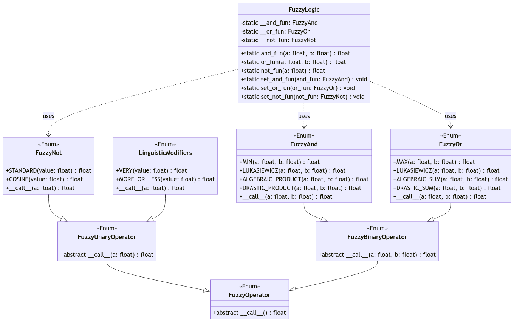

# Fuzzy Logic

The [`fuzzy_logic`](./api.md/#pyPRUF.fuzzy_logic) module provides a set of classes for performing fuzzy logic operations. Fuzzy logic is an approach to computing based on "degrees of truth" ([0, 1]) rather than the usual "true or false" (1 or 0) Boolean logic. This module includes classes for fuzzy AND, OR, and NOT operations, as well as linguistic modifiers. It also allows you to set custom truth functions for these operations.

> Please refer to the [API](./api.md/#pyPRUF.fuzzy_logic) doc for some usage examples.

## Class Hierarchy

The class hierarchy in this module is designed to encapsulate various fuzzy logic operators and modifiers in a structured, extensible, and reusable way. The primary design choices reflect the need for clear abstraction, the separation of concerns, and the flexibility to define and apply different fuzzy logic operations within a common framework.

Here’s an overview of the class hierarchy and the rationale behind its design:



1. [`FuzzyOperator`](./api.md/#pyPRUF.fuzzy_logic.FuzzyOperator) (`Enum`)

    **Purpose**: `FuzzyOperator` is an abstract base class designed as an enumeration (`Enum`). It serves as the foundational class for all fuzzy operators (unary and binary) by providing a common interface (__call__() method) that derived classes must implement.
    
    **Rationale**: By using an `Enum` as a base class, the design allows for defining multiple concrete implementations of fuzzy operators in a single class, with each implementation corresponding to a different value of the `Enum`. This approach provides flexibility and extensibility while keeping the implementation organized.

2. [`FuzzyUnaryOperator`](./api.md/#pyPRUF.fuzzy_logic.FuzzyUnaryOperator) (`FuzzyOperator`)

    **Purpose**: `FuzzyUnaryOperator` is an abstract class that extends `FuzzyOperator`. It specifically handles unary fuzzy operations, which take a single membership value and return another membership value.
    
    **Rationale**: The separation into unary and binary operators allows for a clear distinction between operations that act on a single input (`FuzzyUnaryOperator`) versus those that act on two inputs (`FuzzyBinaryOperator`). This separation enforces correct usage and enhances code clarity.

3. [`FuzzyBinaryOperator`](./api.md/#pyPRUF.fuzzy_logic.FuzzyBinaryOperator) (`FuzzyOperator`)

    **Purpose**: `FuzzyBinaryOperator` is an abstract class that extends `FuzzyOperator`. It defines a common interface for all binary fuzzy operations, which take two membership values and return another membership value.
    
    **Rationale**: Just like `FuzzyUnaryOperator`, this class enforces a clear structure for binary operations, ensuring that all binary operators adhere to a common interface, thereby promoting consistency and reducing the potential for errors in implementation.

4. [`FuzzyAnd`](./api.md/#pyPRUF.fuzzy_logic.FuzzyAnd) (`FuzzyBinaryOperator`)

    **Purpose**: `FuzzyAnd` is a concrete implementation of `FuzzyBinaryOperator`, defining various t-norms (truth functions) that represent fuzzy AND operations.
    
    **Rationale**: By encapsulating all AND-related operations within a single class, the design simplifies the management and usage of different t-norms. Users can easily switch between different fuzzy AND operations by changing the enum value used.

5. [`FuzzyOr`](./api.md/#pyPRUF.fuzzy_logic.FuzzyOr) (`FuzzyBinaryOperator`)

    **Purpose**: `FuzzyOr` is a concrete implementation of `FuzzyBinaryOperator`, providing different t-conorms (truth functions) for fuzzy OR operations.
    
    **Rationale**: Similar to `FuzzyAnd`, this class groups all OR-related operations, making it easy to manage and apply different fuzzy OR operations.

6. [`FuzzyNot`](./api.md/#pyPRUF.fuzzy_logic.FuzzyNot) (`FuzzyUnaryOperator`)

    **Purpose**: `FuzzyNot` is a concrete implementation of `FuzzyUnaryOperator`, defining various truth functions for fuzzy NOT operations.
    
    **Rationale**: This class centralizes the definition of fuzzy NOT operations, allowing for easy extension and modification of negation functions. The user can select the appropriate negation method based on the specific requirements of their fuzzy logic system.

7. [`FuzzyLogic`](./api.md/#pyPRUF.fuzzy_logic.FuzzyLogic)

    **Purpose**: `FuzzyLogic` is a static class that manages the current truth functions for fuzzy AND, OR, and NOT operations. It provides methods to set and retrieve the current fuzzy logic operations, ensuring consistency across the system.
    
    **Rationale**: The `FuzzyLogic` class abstracts the management of fuzzy operations, allowing the underlying operations to be swapped out or modified without affecting the rest of the system. This promotes flexibility and enables users to customize their fuzzy logic operations easily.

8. [`LinguisticModifiers`](./api.md/#pyPRUF.fuzzy_logic.LinguisticModifiers) (`FuzzyUnaryOperator`)

    **Purpose**: `LinguisticModifiers` is a concrete implementation of `FuzzyUnaryOperator`, providing methods to apply linguistic modifiers (e.g., 'VERY', 'MORE_OR_LESS') to fuzzy sets. These modifiers adjust the degree of membership to reflect linguistic semantics.
    
    **Rationale**: By encapsulating linguistic modifiers within their own class, the design ensures that these operations are clearly separated from the basic fuzzy logic operations. This enhances readability and maintains a clean separation of concerns, making the system more modular and easier to maintain.

## Custom Truth Functions

Custom truth functions such as t-norms and t-conorms can be defined by extending the corresponding class (such as `FuzzyAnd`, `FuzzyOr` and `FuzzyNot`) and by adding new `Enum` values corresponding to new custom implementations to add. The following is an example for each operation:

```python
class CustomFuzzyAnd(FuzzyAnd):

    @member
    def NEW_IMPLEMENTATION(a: float, b:float) -> float:
        # calculate and return
        pass

    def __call__(self, a: float, b: float) -> float:
        return super().__call__(a, b)

class CustomFuzzyOr(FuzzyOr):

    @member
    def NEW_IMPLEMENTATION(a: float, b:float) -> float:
        # calculate and return
        pass

    def __call__(self, a: float, b: float) -> float:
        return super().__call__(a, b)

class CustomFuzzyNot(FuzzyNot):

    @member
    def NEW_IMPLEMENTATION(a: float) -> float:
        # calculate and return
        pass

    def __call__(self, a: float) -> float:
        return super().__call__(a)
```

By doing so it is possible to set them as the current AND, OR and NOT (by calling the methods [`set_and_fun`](./api.md/#pyPRUF.fuzzy_logic.FuzzyLogic.set_and_fun), [`set_or_fun`](./api.md/#pyPRUF.fuzzy_logic.FuzzyLogic.set_or_fun) and [`set_not_fun`](./api.md/#pyPRUF.fuzzy_logic.FuzzyLogic.set_not_fun)) truth functions in the static class FuzzyLogic in order to change the behaviour of the [`DiscreteFuzzySet`](./api.md/#pyPRUF.fuzzy_set.DiscreteFuzzySet) methods by using custom truth functions depending on the context of use.